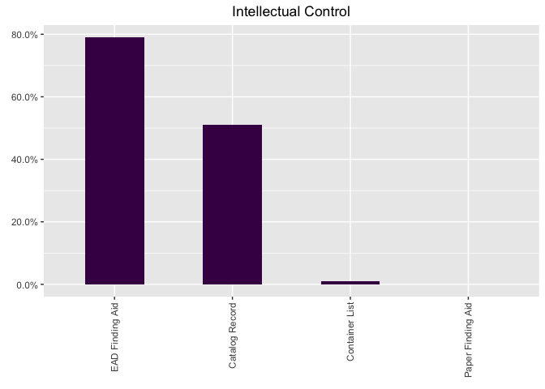
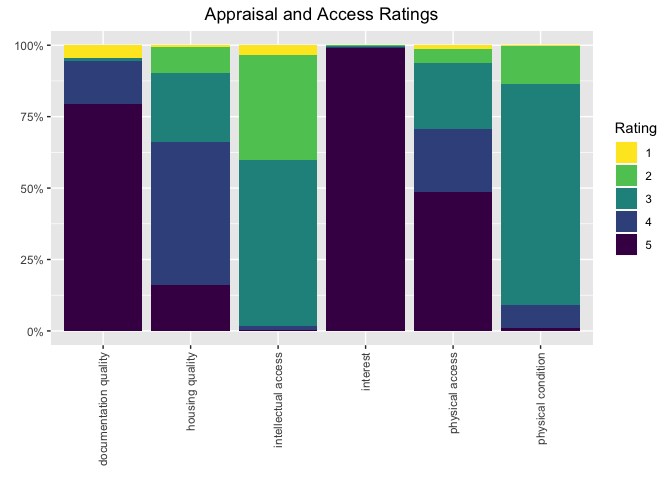

Assessment Data Exploration
================
Adam Gray
2020-03-16

## Introduction

The ArchivesSpace assessment “Record List” report can hold valuable data
about a repository that can be leveraged in different contexts
(strategic planning, collections management, etc.). However, the
complexity of the report and the number of columns (70+) in the .csv can
pose challenges to users wishing to make the most of their assessment
data. This script aims to support the leveraging of assessment data by
making it possible to:

1)  get “big picture” views of assessment data by counting and creating
    plots for key variables and
2)  find assessment records that meet specific criteria and write them
    to a new file

...without combing through the .csv in a spreadsheet application. It can be
easily modified to suit individual circumstances.

I began working on this project when I was looking for an efficient way
to examine assessment data while working as a project archivist. At the
same time, it provided the impetus for me to get my feet wet with data
exploration and plotting in R.

## Example Outputs

### Generate counts for access tools

| count | type              | exists | portion |
| ----: | :---------------- | :----- | ------: |
|  3709 | EAD Finding Aid   | Yes    |    0.79 |
|  2412 | Catalog Record    | Yes    |    0.51 |
|    31 | Container List    | Yes    |    0.01 |
|     1 | Paper Finding Aid | Yes    |    0.00 |

### Plot the counts

<!-- -->

### Generate counts for ratings

| count | category              | rating | portion |
| ----: | :-------------------- | -----: | ------: |
|     2 | interest              |      1 |    0.00 |
|    11 | interest              |      2 |    0.00 |
|    13 | interest              |      3 |    0.00 |
|    11 | interest              |      4 |    0.00 |
|  4486 | interest              |      5 |    0.95 |
|   198 | documentation quality |      1 |    0.04 |
|     7 | documentation quality |      2 |    0.00 |
|    49 | documentation quality |      3 |    0.01 |
|   677 | documentation quality |      4 |    0.14 |
|  3596 | documentation quality |      5 |    0.77 |
|   154 | intellectual access   |      1 |    0.03 |
|  1722 | intellectual access   |      2 |    0.37 |
|  2730 | intellectual access   |      3 |    0.58 |
|    65 | intellectual access   |      4 |    0.01 |
|     8 | intellectual access   |      5 |    0.00 |

### Plot the ratings counts

<!-- -->
